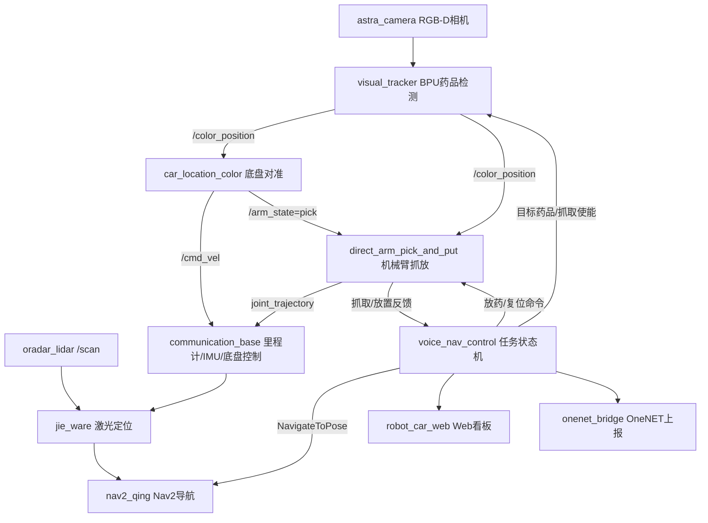

# 小青送药机器人 ROS2 工作空间

[English](README.md) | 简体中文

这是一个面向嵌入式/机器人竞赛的 ROS 2 送药机器人工作空间。系统集成了底盘控制、激光雷达定位、Nav2 自主导航、RGB-D/BPU 药品识别、机械臂固定轨迹抓放、Web 状态看板、OneNET 云端上报，以及可选的大模型语音助手。

本仓库建议作为 ROS 2 工作空间的 `src` 目录使用。

## 功能特性

- 语音指令驱动的送药任务流程。
- 基于 Nav2 的自主导航，内置药房、病房、休息区点位。
- MS200/Oradar 激光雷达驱动与激光定位。
- Astra RGB-D 相机输入。
- BPU 模型推理识别目标药品。
- 抓取前通过视觉反馈控制底盘对准。
- 六轴机械臂固定姿态抓取和放置。
- Web 看板显示机器人状态、任务进度、机械臂阶段和送药记录。
- 可选 OneNET MQTT 云端上报。
- 可选 ASR/LLM/TTS 大模型语音助手。

## 系统架构


更完整的系统图和任务流程图见：

- `软件系统架构图.md`
- `diagrams/`

## 整体链路设计思路

这个工程不是几个孤立 Demo 的堆叠，而是围绕一条完整送药任务链路组织：

1. `voice_nav_control/launch/voice_nav_launch.py` 是全系统入口。它先拉起导航底座，再延迟启动相机和机械臂抓取链路，最后启动送药任务状态机和可选 OneNET 上报。
2. `communication_base`、`p2117_ros`、`ros2_astra_camera-master`、`jie_ware`、`nav2_qing` 构成机器人运行底座，分别提供底盘串口控制、里程计/IMU、激光扫描、RGB-D 图像、定位、地图和 Nav2 目标执行。
3. `voice_nav_control` 是任务编排中心。它把语音串口码转换为送药任务，发送 `NavigateToPose`，发布目标药品和抓取使能，等待抓取/放置反馈，持续输出 JSON 任务状态，并在任务结束时发布送药记录。
4. `robot_arm_control` 按“识别、对准、执行”拆成三段。`visual_tracker.py` 只负责 BPU 药品检测并发布 `/color_position`；`car_location_color.py` 根据视觉角度和深度误差控制底盘 `/cmd_vel`，稳定对准后发布 `/arm_state=pick`；`direct_arm_pick_and_put.py` 复核最新视觉目标后执行固定姿态抓取/放置，并回传 `/medicine_pick_state` 和 `/arm_phase`。
5. `robot_car_web` 和 `onenet_bridge` 只订阅任务、底盘和送药记录状态，不参与运动闭环控制，让监控和云端上报与关键运动链路解耦。
6. 标定边界是明确的：房间/药房/休息区点位在 `voice_nav_control/params/voice_nav_params.yaml`，导航参数在 `nav2_qing/param/nav2_qing_4wd.yaml`，不同药品的视觉对准点、深度和机械臂姿态在 `robot_arm_control/config/medicine_detect_params.yaml`。

## 目录说明

| 路径 | 作用 |
| --- | --- |
| `voice_nav_control/` | 语音串口命令解析、任务状态机、Nav2 Action 客户端、送药流程控制。 |
| `robot_arm_control/` | 当前主用的 BPU 药品识别、底盘对准、机械臂直接抓放流程。 |
| `nav2_qing/` | Nav2 启动文件、地图、参数、RViz 配置和语义点位。 |
| `communication_base/` | 轮趣底盘串口桥接、里程计、IMU、电压、超声波、机械臂轨迹转发。 |
| `jie_ware/` | 激光定位和导航辅助节点。 |
| `p2117_ros/` | Oradar/MS200 激光雷达驱动包，安装后的包名是 `oradar_lidar`。 |
| `ros2_astra_camera-master/` | Astra/Orbbec RGB-D 相机驱动和消息定义。 |
| `slam_cartgorpher/` | Cartographer 建图/定位支持和已保存地图。 |
| `robot_car_web/` | C++ Web 看板节点。 |
| `onenet_bridge/` | OneNET MQTT 桥接，用于状态和送药记录上报。 |
| `robot_ai/` | 可选大模型语音助手，包含 ASR、LLM、TTS。 |
| `robot_arm/` | 机械臂 MoveIt 配置。 |
| `mini_4wd_six_arm/` | 机器人描述、mesh 和关节名配置。 |
| `robot_arm_pick/` | 旧版/实验性机械臂抓取包。 |
| `key_control/` | 键盘遥控辅助包。 |
| `qing_robot_msgs/` | 自定义 ROS 2 消息定义。 |

## 主运行流程

1. 语音模块通过串口向 `voice_nav_control` 发送命令。
2. 任务节点等待“病房命令”和“药品命令”。
3. 机器人通过 `NavigateToPose` 导航到药房。
4. `voice_nav_control` 发布以下话题启动抓药：
   - `/target_medicine`
   - `/medicine_pick_enable`
5. `visual_tracker.py` 识别目标药品并发布 `/color_position`。
6. `car_location_color.py` 根据类别专属目标点和深度参数发布 `/cmd_vel` 控制底盘对准。
7. 底盘稳定对准后，`car_location_color.py` 发布 `/arm_state=pick`；`direct_arm_pick_and_put.py` 复核最新视觉目标并发布机械臂/夹爪关节轨迹执行抓取。
8. 机器人导航到病房门口，再进入病房送药点。
9. `voice_nav_control` 发布 `/arm_state=rotate_put`，机械臂旋转放药。
10. 系统发布 `/medicine_delivery_record`，Web 看板显示记录，OneNET 可同步上报。
11. 若参数开启，机器人返回休息区。

## 默认硬件假设

该项目与实车硬件强相关。默认配置大致假设以下硬件：

- 四轮移动底盘，兼容轮趣底盘控制协议。
- 六轴机械臂和夹爪。
- MS200/Oradar 激光雷达，默认设备 `/dev/oradar_lidar`。
- Orbbec/Astra RGB-D 相机。
- 语音识别/播报串口模块，默认设备 `/dev/ttyS1`。
- 带 BPU 运行环境的控制板，系统可调用 `hrt_model_exec`。

如果换硬件，需要修改串口、相机话题、地图路径、模型路径和标定参数。

## 依赖

典型运行依赖包括：

- ROS 2、`ament_cmake`、`ament_python`、`colcon`。
- Nav2。
- `robot_localization`。
- 使用 `slam_cartgorpher` 时需要 Cartographer ROS。
- `cv_bridge`、OpenCV、NumPy、PIL/Pillow、`message_filters`、`pyserial`。
- Astra/Orbbec 相机运行库。
- BPU 运行环境，且 `hrt_model_exec` 在 `PATH` 中可用。
- 可选：OneNET 相关 MQTT/OpenSSL 开发库。
- 可选：`robot_ai` 需要 `dashscope`、`sounddevice`、`requests`、`beautifulsoup4`、`PyYAML`。

具体安装方式请根据目标 ROS 2 发行版和开发板镜像调整。

## 编译

创建 ROS 2 工作空间，并将本仓库克隆到 `src` 目录：

```bash
mkdir -p ~/qian_sai_ws/src
cd ~/qian_sai_ws/src
git clone <your-repository-url> qing_medicine_robot

cd ~/qian_sai_ws
rosdep install --from-paths src --ignore-src -r -y
colcon build --symlink-install
source install/setup.bash
```

如果部署路径不是 `/home/sunrise/qian_sai`，运行前需要修改 launch 和 config 文件中的硬编码路径。

## 快速启动

启动完整送药系统：

```bash
source ~/qian_sai_ws/install/setup.bash
ros2 launch voice_nav_control voice_nav_launch.py
```

常用启动参数：

```bash
ros2 launch voice_nav_control voice_nav_launch.py \
  start_rviz:=false \
  start_cloud:=false \
  robot_serial_port:=/dev/robot_controller \
  lidar_serial_port:=/dev/oradar_lidar \
  use_astra:=true
```

只启动导航：

```bash
ros2 launch nav2_qing nav2_qing.launch.py
```

只启动药品识别和机械臂抓取：

```bash
ros2 launch robot_arm_control medicine_detect.launch.py
```

启动 Web 看板：

```bash
ros2 launch robot_car_web car_web.launch.py
```

浏览器访问：

```text
http://<机器人IP>:8080
```

## 安全默认配置

公开配置文件不包含真实云端或大模型密钥。`onenet_bridge/config/onenet_bridge.yaml` 默认清空 OneNET 凭据并关闭云端上传，`robot_ai/config/params.yaml` 默认清空 `dashscope_api_key`。实车部署时请使用环境变量或未纳入 Git 的私有配置文件。

## 关键配置

| 文件 | 配置内容 |
| --- | --- |
| `voice_nav_control/params/voice_nav_params.yaml` | 语音命令码、播报码、药房/病房/休息区坐标、任务超时和等待时间。 |
| `robot_arm_control/config/medicine_detect_params.yaml` | 相机话题、BPU 模型路径、药品类别、目标对准标定、机械臂关节姿态。 |
| `nav2_qing/param/nav2_qing_4wd.yaml` | Nav2 planner、controller、costmap、定位参数。 |
| `nav2_qing/map/` | 栅格地图和相关地图资源。 |
| `nav2_qing/config/semantic_locations.yaml` | 竞赛地图中的语义点位。 |
| `communication_base/config/` | 底盘串口参数、机器人模型、TF、IMU、EKF 参数。 |
| `onenet_bridge/config/onenet_bridge.yaml` | OneNET 产品和设备参数。公开示例已清空凭据，并默认关闭云端上传。 |
| `robot_ai/config/params.yaml` | 可选语音助手的 ASR/LLM/TTS 和音频设备参数。公开示例已清空 `dashscope_api_key`，建议使用 `DASHSCOPE_API_KEY`。 |

## 关键话题和 Action

| 名称 | 类型 | 作用 |
| --- | --- | --- |
| `navigate_to_pose` | Action | 任务状态机调用 Nav2 发送导航目标。 |
| `/goal_pose` | `geometry_msgs/PoseStamped` | 可选兼容目标点话题。 |
| `/scan` | `sensor_msgs/LaserScan` | 激光雷达扫描。 |
| `/odom` | `nav_msgs/Odometry` | 底盘里程计。 |
| `/imu/data_raw` | `sensor_msgs/Imu` | 原始 IMU 数据。 |
| `/cmd_vel` | `geometry_msgs/Twist` | 底盘速度命令。 |
| `/camera/color/image_raw` | `sensor_msgs/Image` | 药品识别彩色图像。 |
| `/camera/depth/image_raw` | `sensor_msgs/Image` | 目标距离深度图像。 |
| `/target_medicine` | `std_msgs/String` | 当前任务选择的目标药品。 |
| `/medicine_pick_enable` | `std_msgs/Bool` | 开启或关闭视觉抓药。 |
| `/color_position` | `robot_arm_control/SixArmPosition` | 目标角度、距离、类别和有效性。 |
| `/arm_state` | `std_msgs/String` | 机械臂动作命令，例如 `pick`、`rotate_put`、`no_msg`。 |
| `/medicine_pick_state` | `std_msgs/String` | 抓取/放置过程和结果反馈。 |
| `/arm_phase` | `std_msgs/String` | 机械臂阶段状态，用于任务状态和 Web 显示。 |
| `/voice_nav_task` | `std_msgs/String` | JSON 格式任务状态。 |
| `/medicine_delivery_record` | `std_msgs/String` | JSON 格式送药完成记录。 |

## 标定注意事项

实车运行前建议逐项确认：

- 地图原点和 Nav2 定位是否稳定。
- `room_xxx_door`、`room_xxx_delivery`、`pharmacy`、`rest_area` 坐标准确性。
- 激光雷达 frame 和 `base_footprint -> laser` 静态 TF。
- 相机话题、RGB-D 同步和深度单位。
- BPU 模型路径和类别顺序。
- `class_target` 中不同药品的视觉对准点和抓取距离。
- `arm_look`、`arm_clamp`、`arm_uplift`、`arm_rotate_put` 等机械臂关节姿态。
- 夹爪打开/闭合角度。
- 急停、测试场地和人员安全。

## 开源前检查清单

推送到公开 GitHub 仓库前，请务必检查：

- 删除或轮换所有真实密钥。
- 重点检查 `onenet_bridge/config/onenet_bridge.yaml` 和 `robot_ai/config/params.yaml`。
- 将私有 key/API token 改为环境变量或未纳入 Git 的本地配置。
- 删除生成文件：`build/`、`install/`、`log/`、`__pycache__/`、`.egg-info/`、`node_modules/`、压缩包等，除非确实需要发布。
- 检查第三方驱动、模型文件、mesh 资源的许可证是否允许公开分发。
- 添加仓库级 `LICENSE` 文件。
- 确认训练模型文件是否允许随仓库发布。
## 许可证

该工作空间包含原创竞赛代码，也包含第三方/厂商驱动和资源。正式开源前请添加仓库级许可证，并保留第三方驱动、模型和资源的原始许可证说明。
