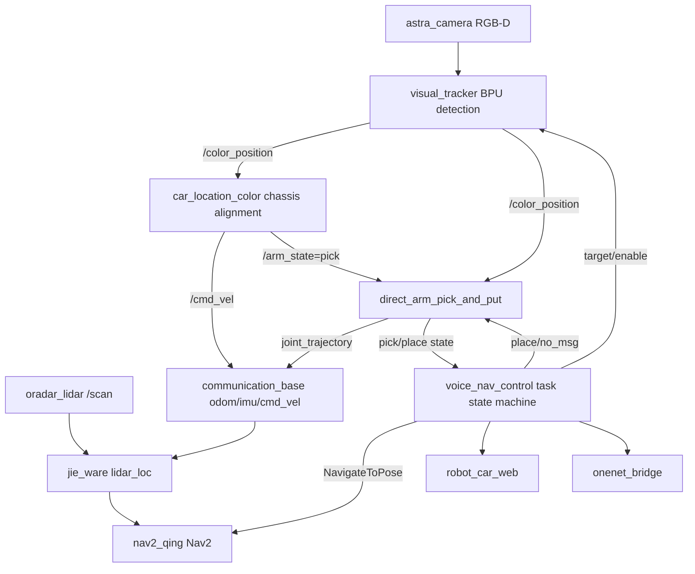

# Qing Medicine Delivery Robot

English | [简体中文](README-CN.md)

ROS 2 workspace for a competition-oriented autonomous medicine delivery robot. The system combines chassis control, lidar localization, Nav2 navigation, RGB-D/BPU medicine detection, direct robotic-arm grasping, a web dashboard, OneNET cloud reporting, and an optional AI voice assistant.

This repository is intended to be used as the `src` tree of a ROS 2 workspace.

## Features

- Voice-command task flow for medicine delivery.
- Nav2-based autonomous navigation with predefined pharmacy, ward, and rest-area poses.
- MS200/Oradar lidar driver and scan-based localization.
- Astra RGB-D camera input for medicine detection.
- BPU model inference for target medicine recognition.
- Chassis visual alignment before grasping.
- Direct fixed-pose six-axis arm pick/place sequence.
- Web dashboard for robot status, task progress, arm state, and delivery records.
- Optional OneNET MQTT reporting.
- Optional LLM-based voice assistant package.

## System Architecture



More detailed architecture diagrams are available in:

- `软件系统架构图.md`
- `diagrams/`

## End-to-End Design Rationale

The project is organized around a single task orchestration chain, not around isolated demo nodes:

1. `voice_nav_control/launch/voice_nav_launch.py` is the full-system entry point. It starts the navigation stack, delays the camera/arm pipeline until the base stack is ready, and then starts the medicine-delivery state machine plus optional cloud reporting.
2. `communication_base`, `p2117_ros`, `ros2_astra_camera-master`, `jie_ware`, and `nav2_qing` provide the reusable robot substrate: chassis serial control, odometry/IMU, lidar scans, RGB-D images, localization, maps, and Nav2 goals.
3. `voice_nav_control` is the task brain. It converts speech serial codes into delivery tasks, sends `NavigateToPose` goals, publishes target-medicine and pick-enable commands, waits for pick/place feedback, updates JSON task status, and emits the final delivery record.
4. `robot_arm_control` is deliberately split into three stages. `visual_tracker.py` only detects the selected medicine and publishes `/color_position`; `car_location_color.py` uses that visual/depth error to align the chassis and then publishes `/arm_state=pick`; `direct_arm_pick_and_put.py` performs the fixed-pose grasp/place sequence and reports `/medicine_pick_state` plus `/arm_phase`.
5. `robot_car_web` and `onenet_bridge` subscribe to the same task/status topics instead of controlling the task flow. This keeps monitoring and cloud reporting outside the motion-critical loop.
6. The main calibration boundary is explicit: map poses live in `voice_nav_control/params/voice_nav_params.yaml`, Nav2 behavior lives in `nav2_qing/param/nav2_qing_4wd.yaml`, and medicine-specific visual/grasp "sweet spots" live in `robot_arm_control/config/medicine_detect_params.yaml`.

## Repository Layout

| Path | Purpose |
| --- | --- |
| `voice_nav_control/` | Voice command parsing, task state machine, Nav2 action client, delivery workflow. |
| `robot_arm_control/` | Main BPU medicine detection, chassis alignment, and direct arm pick/place workflow. |
| `nav2_qing/` | Nav2 launch files, maps, parameters, RViz config, semantic locations. |
| `communication_base/` | Wheeltec chassis serial bridge, odometry, IMU, voltage, ultrasonic, arm trajectory forwarding. |
| `jie_ware/` | Lidar localization and navigation helper nodes. |
| `p2117_ros/` | Oradar/MS200 lidar driver package, installed as `oradar_lidar`. |
| `ros2_astra_camera-master/` | Astra/Orbbec RGB-D camera driver and message definitions. |
| `slam_cartgorpher/` | Cartographer mapping/localization support and saved map files. |
| `robot_car_web/` | C++ web dashboard node. |
| `onenet_bridge/` | OneNET MQTT bridge for delivery records and robot status. |
| `robot_ai/` | Optional ASR/LLM/TTS voice assistant. |
| `robot_arm/` | MoveIt configuration for the arm. |
| `mini_4wd_six_arm/` | Robot description, meshes, and joint names. |
| `robot_arm_pick/` | Legacy/experimental arm picking package. |
| `key_control/` | Keyboard teleoperation helper. |
| `qing_robot_msgs/` | Custom ROS 2 message definitions. |

## Main Runtime Flow

1. The speech module sends a serial command to `voice_nav_control`.
2. The task node waits for a room command and a medicine command.
3. The robot navigates to the pharmacy through `NavigateToPose`.
4. `voice_nav_control` enables medicine picking by publishing:
   - `/target_medicine`
   - `/medicine_pick_enable`
5. `visual_tracker.py` detects the target medicine and publishes `/color_position`.
6. `car_location_color.py` aligns the chassis by publishing `/cmd_vel`, using the class-specific target point and depth settings.
7. After stable alignment, `car_location_color.py` publishes `/arm_state=pick`; `direct_arm_pick_and_put.py` verifies the latest visual target and publishes arm/hand joint trajectories.
8. The robot navigates to the ward door, then to the delivery point.
9. `voice_nav_control` publishes `/arm_state=rotate_put`, and the arm places the medicine.
10. A delivery record is published to `/medicine_delivery_record` and can be shown on the web dashboard or uploaded to OneNET.
11. The robot returns to the rest area if configured.

## Hardware Assumptions

This project is hardware-specific. The default launch files and parameters assume a robot similar to:

- Four-wheel mobile chassis with Wheeltec-compatible controller.
- Six-axis robotic arm with gripper.
- MS200/Oradar lidar on `/dev/oradar_lidar`.
- Orbbec/Astra RGB-D camera.
- Serial speech-recognition/broadcast module on `/dev/ttyS1`.
- Controller board with BPU runtime and `hrt_model_exec`.

Adjust serial ports, camera topics, map paths, model paths, and calibration parameters before running on different hardware.

## Dependencies

Typical runtime dependencies include:

- ROS 2 with `ament_cmake`, `ament_python`, and `colcon`.
- Nav2 stack.
- `robot_localization`.
- Cartographer ROS if using `slam_cartgorpher`.
- `cv_bridge`, OpenCV, NumPy, PIL/Pillow, `message_filters`, `pyserial`.
- Astra/Orbbec camera runtime.
- BPU runtime with `hrt_model_exec` available in `PATH`.
- Optional: MQTT and OpenSSL development libraries for OneNET.
- Optional: `dashscope`, `sounddevice`, `requests`, `beautifulsoup4`, `PyYAML` for `robot_ai`.

Install exact dependencies according to your target ROS 2 distribution and board image.

## Build

Create a ROS 2 workspace and clone this repository into `src`:

```bash
mkdir -p ~/qian_sai_ws/src
cd ~/qian_sai_ws/src
git clone <your-repository-url> qing_medicine_robot

cd ~/qian_sai_ws
rosdep install --from-paths src --ignore-src -r -y
colcon build --symlink-install
source install/setup.bash
```

If your deployment path is not `/home/sunrise/qian_sai`, update hard-coded paths in launch/config files before running.

## Quick Start

Start the full medicine delivery stack:

```bash
source ~/qian_sai_ws/install/setup.bash
ros2 launch voice_nav_control voice_nav_launch.py
```

Common launch overrides:

```bash
ros2 launch voice_nav_control voice_nav_launch.py \
  start_rviz:=false \
  start_cloud:=false \
  robot_serial_port:=/dev/robot_controller \
  lidar_serial_port:=/dev/oradar_lidar \
  use_astra:=true
```

Start only navigation:

```bash
ros2 launch nav2_qing nav2_qing.launch.py
```

Start only medicine vision and arm control:

```bash
ros2 launch robot_arm_control medicine_detect.launch.py
```

Start the web dashboard:

```bash
ros2 launch robot_car_web car_web.launch.py
```

Then open:

```text
http://<robot-ip>:8080
```

## Security Defaults

Public configuration files do not include real cloud or LLM credentials. OneNET upload is disabled by default in `onenet_bridge/config/onenet_bridge.yaml`, and `robot_ai/config/params.yaml` leaves `dashscope_api_key` empty. Use environment variables or a private deployment config for real credentials.

## Important Configuration

| File | What to configure |
| --- | --- |
| `voice_nav_control/params/voice_nav_params.yaml` | Speech command codes, broadcast codes, pharmacy/ward/rest-area poses, task timing. |
| `robot_arm_control/config/medicine_detect_params.yaml` | Camera topics, BPU model path, medicine class names, target alignment calibration, arm joint poses. |
| `nav2_qing/param/nav2_qing_4wd.yaml` | Nav2 planners, controllers, costmaps, AMCL/localization settings. |
| `nav2_qing/map/` | Occupancy grid map and related map assets. |
| `nav2_qing/config/semantic_locations.yaml` | Named semantic locations used by the competition map. |
| `communication_base/config/` | Chassis serial parameters, robot model, TF, IMU, EKF settings. |
| `onenet_bridge/config/onenet_bridge.yaml` | OneNET product/device parameters. The public sample leaves credentials empty and cloud upload disabled. |
| `robot_ai/config/params.yaml` | Optional ASR/LLM/TTS and audio-device settings. The public sample leaves `dashscope_api_key` empty; prefer `DASHSCOPE_API_KEY`. |

## Key Topics And Actions

| Name | Type | Purpose |
| --- | --- | --- |
| `navigate_to_pose` | Action | Nav2 navigation goal used by the task state machine. |
| `/goal_pose` | `geometry_msgs/PoseStamped` | Optional legacy goal topic bridge. |
| `/scan` | `sensor_msgs/LaserScan` | Lidar scan input. |
| `/odom` | `nav_msgs/Odometry` | Chassis odometry. |
| `/imu/data_raw` | `sensor_msgs/Imu` | Raw IMU data. |
| `/cmd_vel` | `geometry_msgs/Twist` | Chassis velocity command. |
| `/camera/color/image_raw` | `sensor_msgs/Image` | RGB image for medicine detection. |
| `/camera/depth/image_raw` | `sensor_msgs/Image` | Depth image for target distance. |
| `/target_medicine` | `std_msgs/String` | Target medicine selected by the task state machine. |
| `/medicine_pick_enable` | `std_msgs/Bool` | Enables/disables vision-guided picking. |
| `/color_position` | `robot_arm_control/SixArmPosition` | Detected target angle, depth, class, and validity. |
| `/arm_state` | `std_msgs/String` | Arm command such as `pick`, `rotate_put`, or `no_msg`. |
| `/medicine_pick_state` | `std_msgs/String` | Pick/place result and progress feedback. |
| `/arm_phase` | `std_msgs/String` | Normalized arm phase for UI/task status. |
| `/voice_nav_task` | `std_msgs/String` | JSON task status for dashboard/cloud consumers. |
| `/medicine_delivery_record` | `std_msgs/String` | JSON delivery completion record. |

## Calibration Notes

Before a real run, verify:

- Map origin and Nav2 localization.
- `room_xxx_door`, `room_xxx_delivery`, `pharmacy`, and `rest_area` poses.
- Lidar frame and `base_footprint -> laser` static TF.
- Camera topics and RGB-depth synchronization.
- BPU model path and class-name order.
- Per-medicine target alignment values in `class_target`.
- Arm joint poses such as `arm_look`, `arm_clamp`, `arm_uplift`, and `arm_rotate_put`.
- Gripper open/close values.
- Emergency stop and safe test area.

## Open Source Publishing Checklist

Before pushing to a public GitHub repository:

- Remove or rotate all credentials from tracked files.
- In particular, review `onenet_bridge/config/onenet_bridge.yaml` and `robot_ai/config/params.yaml`.
- Move private keys/API tokens to environment variables or ignored local config files.
- Remove generated files such as `build/`, `install/`, `log/`, `__pycache__/`, `.egg-info/`, `node_modules/`, and compressed archives unless they are intentionally published.
- Check the license compatibility of third-party drivers and vendor assets.
- Add a repository-level `LICENSE` file.
- Verify whether trained model files can be redistributed.

## License

This workspace contains original competition code and third-party/vendor packages. Add a repository-level license before publishing, and keep third-party license notices for included drivers, models, and assets.
