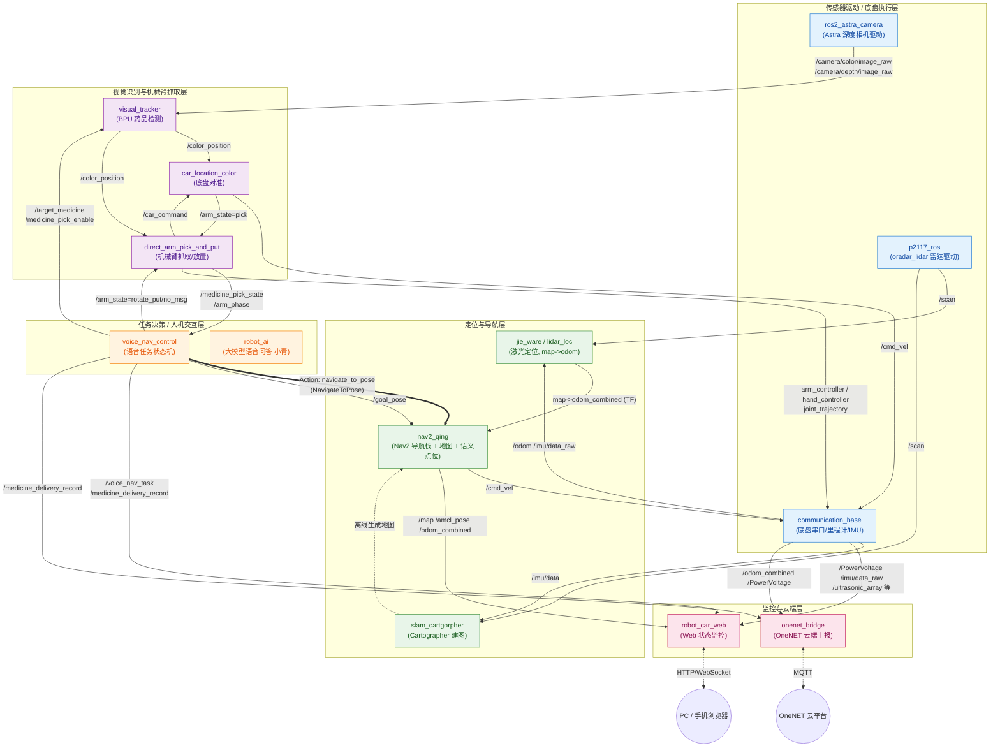
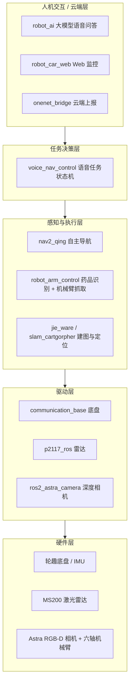
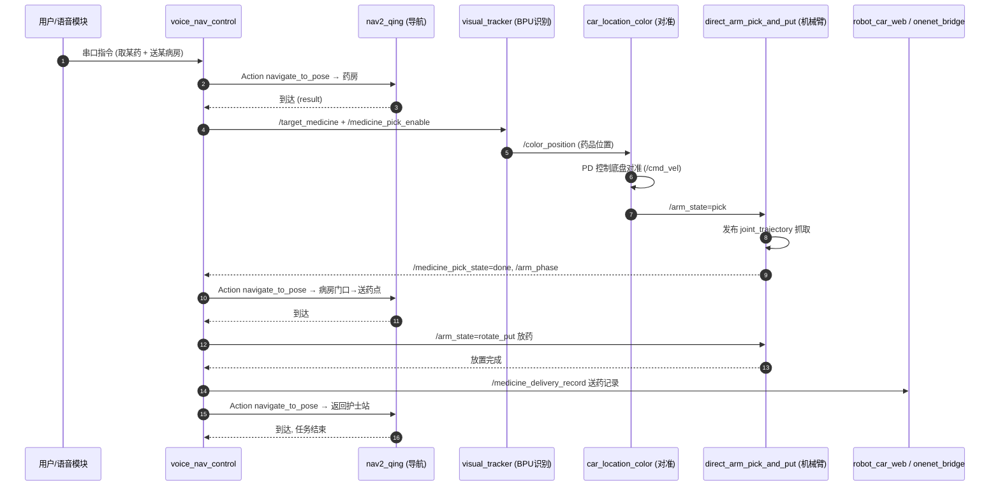

# 1.1.1 软件整体架构图（图2-5 软件系统架构图）

> 说明：本文档中的图均为 Mermaid 源码，可用 VS Code Mermaid 插件、Typora、draw.io 或
> https://mermaid.live 直接渲染并导出为 PNG/SVG 放入报告。所有话题名、Action 名均取自实际代码。

---

## 图2-5 软件系统架构图（ROS2 功能包 / 话题 / Action 关系）

本系统基于 ROS2 构建，按功能分层组织为「传感器驱动层 → 定位导航层 → 任务决策层 → 视觉抓取层 →
人机交互与云端层」，各功能包之间通过话题（Topic）与动作（Action）解耦通信。

---

## 图2-5(备选) 软件系统分层架构图（简化版，适合正文排版）

若上图节点过多不便排版，可用下面这张分层简化图，突出"层"的概念，弱化话题细节。

---

## 图2-6 送药任务执行流程图（任务状态机时序）

配合架构图使用，展示语音下达送药指令后各功能包的协作时序。

---

## 关键话题 / Action 对照表（写报告可引用）

| 通信名称 | 类型 | 发布方 → 订阅方 | 作用 |
|---|---|---|---|
| `navigate_to_pose` | Action (NavigateToPose) | voice_nav_control → nav2_qing | 自主导航目标点 |
| `/goal_pose` | Topic (PoseStamped) | voice_nav_control → nav2_qing | 导航目标位姿 |
| `/scan` | Topic (LaserScan) | p2117_ros → jie_ware/nav2 | 激光雷达扫描 |
| `/camera/color(depth)/image_raw` | Topic (Image) | astra_camera → visual_tracker | 彩色/深度图像 |
| `/color_position` | Topic (SixArmPosition) | visual_tracker → 对准/抓取节点 | 药品像素位置与深度 |
| `/cmd_vel` | Topic (Twist) | nav2 / 对准节点 → communication_base | 底盘速度指令 |
| `/arm_state` | Topic (String) | voice_nav_control/car_location_color → 机械臂 | 机械臂动作指令，`pick` 由底盘对准节点触发，`rotate_put/no_msg` 由任务状态机触发 |
| `joint_trajectory` | Topic (JointTrajectory) | 机械臂节点 → communication_base | 关节轨迹执行 |
| `/medicine_pick_state`,`/arm_phase` | Topic (String) | 机械臂 → voice_nav_control | 抓取/阶段状态回传 |
| `/voice_nav_task` | Topic (String) | voice_nav_control → web | 任务状态 |
| `/medicine_delivery_record` | Topic (String) | voice_nav_control → web/onenet | 送药记录上报 |
| `map->odom_combined` | TF | jie_ware/lidar_loc | 全局定位变换 |
